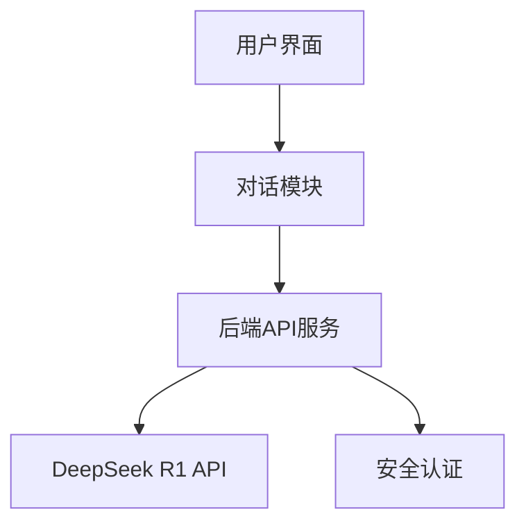

# Life Coach AI 助手

## 项目目标
创建一个基于DeepSeek R1 API的智能Life Coach网站，通过AI对话为用户提供个人成长建议和指导。

## 技术选型
- 前端：React + Vite
  - React 18.2.0 现代化框架
  - Vite 5.1.4 构建工具提供更快的开发体验
  - TailwindCSS 3.4.1 用于UI设计
  - 集成Typography和Forms插件优化排版和表单体验
- 后端：Node.js + Express
  - Express 4.18.2 框架处理HTTP请求
  - 集成DeepSeek R1 API
  - 使用CORS 2.8.5处理跨域请求
  - dotenv 16.4.5管理环境变量
  - node-fetch 3.3.2处理API请求

## 系统架构


## 核心功能模块
1. 对话界面
   - 实时对话窗口
   - 消息历史记录
   - 打字机效果的回复动画

2. AI交互
   - 流式响应处理
   - 上下文管理
   - 错误处理和重试机制

3. 用户体验
   - 响应式设计
   - 深色/浅色主题
   - 加载状态提示

## 样式规范
```css
:root {
  /* 主题色 */
  --primary-color: #4F46E5;
  --secondary-color: #818CF8;
  
  /* 文字颜色 */
  --text-primary: #1F2937;
  --text-secondary: #6B7280;
  
  /* 背景色 */
  --bg-primary: #FFFFFF;
  --bg-secondary: #F3F4F6;
  
  /* 间距 */
  --spacing-base: 1rem;
  --spacing-large: 2rem;
}
```

## 开发计划
1. 项目初始化
   [✓] 创建项目文档
   [✓] 搭建前端框架
   [✓] 配置后端服务
   [✓] 配置TailwindCSS和插件

2. 核心功能开发
   [✓] 实现API通信
     [✓] 集成DeepSeek R1 API
     [✓] 实现流式响应处理
     - [ ] 添加错误重试机制
   [✓] 开发对话界面
     [✓] 创建聊天消息组件
     [✓] 实现打字机效果
     - [ ] 添加消息历史记录
   - [ ] 用户体验功能
     - [ ] 实现深色/浅色主题切换
     [✓] 添加Token计算显示
     - [ ] 集成加载状态提示

3. 优化和测试
   - [ ] UI/UX改进
     - [ ] 优化响应式布局
     - [ ] 改进交互动画
     - [ ] 完善错误提示
   - [ ] 性能优化
     - [ ] 消息历史管理优化
     - [ ] 减少不必要的重渲染
     - [ ] 优化资源加载
   - [ ] 测试和部署
     - [ ] 添加单元测试
     - [ ] 进行性能测试
     - [ ] 配置生产环境部署