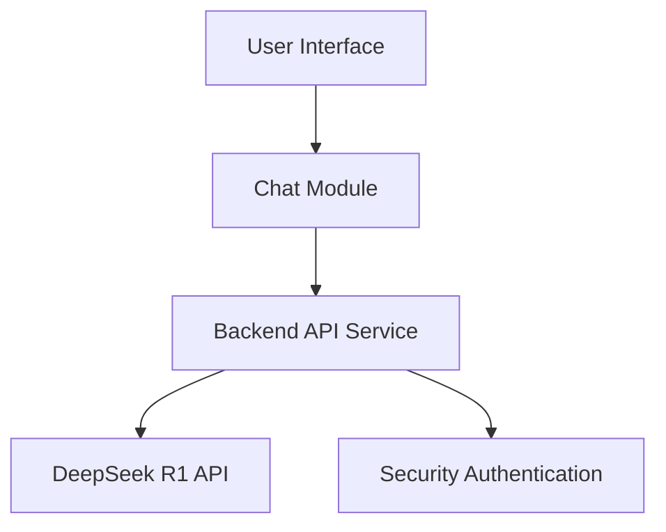

# Life Coach AI Assistant

## Project Goal
Create an intelligent Life Coach website based on DeepSeek R1 API, providing personal growth advice and guidance through AI conversations.

## Technology Stack
- Frontend: React + Vite
  - React 18.2.0 Modern Framework
  - Vite 5.1.4 Build Tool for faster development experience
  - TailwindCSS 3.4.1 for UI design
  - Integrated Typography and Forms plugins for typography and form experience optimization
- Backend: Node.js + Express
  - Express 4.18.2 framework for handling HTTP requests
  - Integration with DeepSeek R1 API
  - CORS 2.8.5 for handling cross-origin requests
  - dotenv 16.4.5 for environment variable management
  - node-fetch 3.3.2 for API requests

## System Architecture


## Core Function Modules
1. Chat Interface
   - Real-time chat window
   - Message history
   - Typewriter effect for responses

2. AI Interaction
   - Stream response processing
   - Context management
   - Error handling and retry mechanism

3. User Experience
   - Responsive design
   - Dark/Light theme
   - Loading state indicators

## Style Guide
```css
:root {
  /* Theme Colors */
  --primary-color: #4F46E5;
  --secondary-color: #818CF8;
  
  /* Text Colors */
  --text-primary: #1F2937;
  --text-secondary: #6B7280;
  
  /* Background Colors */
  --bg-primary: #FFFFFF;
  --bg-secondary: #F3F4F6;
  
  /* Spacing */
  --spacing-base: 1rem;
  --spacing-large: 2rem;
}
```

## Development Plan
1. Project Initialization
   [✓] Create project documentation
   [✓] Set up frontend framework
   [✓] Configure backend service
   [✓] Configure TailwindCSS and plugins

2. Core Feature Development
   [✓] Implement API Communication
     [✓] Integrate DeepSeek R1 API
     [✓] Implement stream response handling
     - [ ] Add error retry mechanism
   [✓] Develop Chat Interface
     [✓] Create chat message components
     [✓] Implement typewriter effect
     - [ ] Add message history
   - [ ] User Experience Features
     - [ ] Implement dark/light theme switch
     [✓] Add token calculation display
     - [ ] Integrate loading state indicators

3. Optimization and Testing
   - [ ] UI/UX Improvements
     - [ ] Optimize responsive layout
     - [ ] Improve interaction animations
     - [ ] Enhance error notifications
   - [ ] Performance Optimization
     - [ ] Message history management optimization
     - [ ] Reduce unnecessary re-renders
     - [ ] Optimize resource loading
   - [ ] Testing and Deployment
     - [ ] Add unit tests
     - [ ] Conduct performance testing
     - [ ] Configure production environment deployment